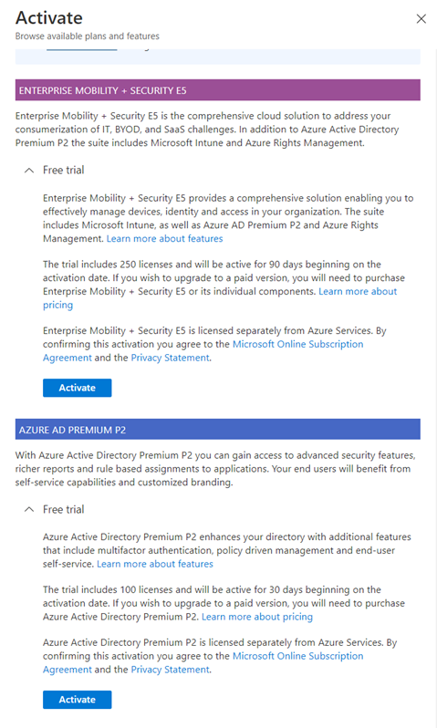

# Coach's Guide - Day 1 - Challenge 00 - Setup

**[Home](./README.md)** - [Next Solution >](./Solution_D1_01.md)

## Introduction

Ensure that your students have gone through the preparation in their environment. At this point, they should have:

An Azure Subscription with Global Administrator Rights on the tenant level.  The students can use an Azure Pass (if provided) and configure the tenant or use an existing subscription. 

“Azure AD Premium P2” is required for configuring Conditional Access Policies and Multifactor Authentication in next challenges.  Students can use “Azure AD Premium P2” or “Enterprise Mobility + Security E5” free trial to enable Azure AD Premium P2 license. 

In case they use the trial licenses in the past they are not able to use it again.

The students should set the Usage Location property for the accounts created. The usage location is required for assigning “Azure AD Premium P2” license to users.

## Other Prerequisites

- Visual Studio 2022 or [Visual Studio Code](https://code.visualstudio.com/ "https://code.visualstudio.com")
- [Git Client](https://git-scm.com/download "https://git-scm.com/download")
- [.NET Core 3.1 SDK](https://dotnet.microsoft.com/en-us/download/dotnet/3.1) and [.NET 6 SDK](https://dotnet.microsoft.com/en-us/download/dotnet/6.0)
- [Azure CLI](https://docs.microsoft.com/en-us/cli/azure/install-azure-cli "https://docs.microsoft.com/en-us/cli/azure/install-azure-cli")
- [PowerShell](https://docs.microsoft.com/en-us/powershell/scripting/install/installing-powershell?view=powershell-7.2)
