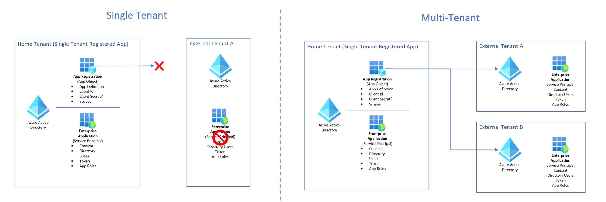

# Coach's Guide - Day 1 - Challenge 07 - Make your application Multitenant

 [< Previous Solution](./Solution_D1_06.md) - **[Home](./README.md)** - [Next Advanced Solution (Optional)>](./Solution_D1_08.md)

## Introduction

In this challenge the students have to make their application multitenant.

The change doesn't need redeployment or any changes in code.

Students should also remove the guest users invited in previous challenges from the External Tenant.

Students should follow the [Making your application multi-tenant](https://learn.microsoft.com/en-us/azure/active-directory/develop/howto-convert-app-to-be-multi-tenant#update-your-code-to-send-requests-to-common) documentation. The following high level steps should be done:

- Update the application registration to be multi-tenant
- Update the application settings of you app to send requests to `/common` endpoint. Set the tenantId app config value to common.

## Answers for Challenge

### 1. Briefly explain the differences between Single Tenant and Multitenant Apps.

Azure Active Directory (Azure AD) organizes objects like users and apps into groups called *tenants*. Tenants allow an administrator to set policies on the users within the organization and the apps that the organization owns to meet their security and operational policies.

#### Who can sign in to your app?

When it comes to developing apps, developers can choose to configure their app to be either single-tenant or multi-tenant during app registration in the [Azure portal](https://portal.azure.com/).

- Single-tenant apps are only available in the tenant they were registered in, also known as their home tenant.
- Multi-tenant apps are available to users in both their home tenant and other tenants.

In the Azure portal, you can configure your app to be single-tenant or multi-tenant by setting the audience as follows.

| Audience                                                                                              | Single/multi-tenant | Who can sign in                                                                                                                                                                                                                                                                                                       |
| ----------------------------------------------------------------------------------------------------- | ------------------- | --------------------------------------------------------------------------------------------------------------------------------------------------------------------------------------------------------------------------------------------------------------------------------------------------------------------- |
| Accounts in this directory only                                                                       | Single tenant       | All user and guest accounts in your directory can use your application or API. *Use this option if your target audience is internal to your organization.*                                                                                                                                                         |
| Accounts in any Azure AD directory                                                                    | Multi-tenant        | All users and guests with a work or school account from Microsoft can use your application or API. This includes schools and businesses that use Microsoft 365. *Use this option if your target audience is business or educational customers.*                                                                    |
| Accounts in any Azure AD directory and personal Microsoft accounts (such as Skype, Xbox, Outlook.com) | Multi-tenant        | All users with a work or school, or personal Microsoft account can use your application or API. It includes schools and businesses that use Microsoft 365 as well as personal accounts that are used to sign in to services like Xbox and Skype. *Use this option to target the widest set of Microsoft accounts.* |

[Single and multi-tenant apps in Azure AD](https://docs.microsoft.com/en-us/azure/active-directory/develop/single-and-multi-tenant-apps)

### 2. Explain the differences between an App Registration (Application object) and Enterprise Application (Service Principal)

#### Application registration

To delegate identity and access management functions to Azure AD, an application must be registered with an Azure AD tenant. When you register your application with Azure AD, you're creating an identity configuration for your application that allows it to integrate with Azure AD. When you register an app in the Azure portal, you choose whether it's a [single tenant](https://learn.microsoft.com/en-us/azure/active-directory/develop/single-and-multi-tenant-apps#who-can-sign-in-to-your-app), or [multi-tenant](https://learn.microsoft.com/en-us/azure/active-directory/develop/single-and-multi-tenant-apps#who-can-sign-in-to-your-app), and can optionally set a [redirect URI](https://learn.microsoft.com/en-us/azure/active-directory/develop/reply-url). For step-by-step instructions on registering an app, see the [app registration quickstart](https://learn.microsoft.com/en-us/azure/active-directory/develop/quickstart-register-app).

When you've completed the app registration, you've a globally unique instance of the app (the application object) which lives within your home tenant or directory. You also have a globally unique ID for your app (the app or client ID). In the portal, you can then add secrets or certificates and scopes to make your app work, customize the branding of your app in the sign-in dialog, and more.

If you register an application in the portal, an application object and a service principal object are automatically created in your home tenant. If you register/create an application using the Microsoft Graph APIs, creating the service principal object is a separate step.

#### Service principal object

To access resources that are secured by an Azure AD tenant, the entity that requires access must be represented by a security principal. This requirement is true for both users (user principal) and applications (service principal). The security principal defines the access policy and permissions for the user/application in the Azure AD tenant. This enables core features such as authentication of the user/application during sign-in, and authorization during resource access.

There are three types of service principals. Our focus will be on **Application ** Service Principal. The App SP can be called Enterprise application:

- **Application** - The type of service principal is the local representation, or application instance, of a global application object in a single tenant or directory. In this case, a service principal is a concrete instance created from the application object and inherits certain properties from that application object. A service principal is created in each tenant where the application is used and references the globally unique app object. The service principal object defines what the app can actually do in the specific tenant, who can access the app, and what resources the app can access.
  
  When an application is given permission to access resources in a tenant (upon registration or consent), a service principal object is created. When you register an application using the Azure portal, a service principal is created automatically. You can also create service principal objects in a tenant using Azure PowerShell, Azure CLI, Microsoft Graph, and other tools.

- **Managed identity** - This type of service principal is used to represent a [managed identity](https://learn.microsoft.com/en-us/azure/active-directory/managed-identities-azure-resources/overview).

- **Legacy** - This type of service principal represents a legacy app, which is an app created before app registrations were introduced or an app created through legacy experiences. 

You can use the **Enterprise applications** page in the Azure portal to list and manage the service principals in a tenant. You can see the service principal's permissions, user consented permissions, which users have done that consent, sign in information, and more.

#### Relationship between application objects and service principals

The application object (App Registration) is the *global* representation of your application for use across all tenants, and the service principal (Enterpise Application) is the *local* representation for use in a specific tenant. The application object (App Registration) serves as the template from which common and default properties are *derived* for use in creating corresponding service principal objects (Enterpise Applications).

An application object (App Registration) has:

- A one-to-one relationship with the software application, and
- A one-to-many relationship with its corresponding service principal object(s) (Enterpise Application)

A service principal (Enterpise Application) must be created in each tenant where the application is used, enabling it to establish an identity for sign-in and/or access to resources being secured by the tenant. A single-tenant application has only one service principal (in its home tenant), created and consented for use during application registration. A multi-tenant application also has a service principal (Enterpise Application) created in each tenant where a user from that tenant has consented to its use.

[Application registration and Service principals](https://docs.microsoft.com/en-us/azure/active-directory/develop/app-objects-and-service-principals)

### 3. Explain the usage of common endpoint

With a multi-tenant application, because the application can't immediately tell which tenant the user is from, requests can't be sent to a tenant’s endpoint. Instead, requests are sent to an endpoint that multiplexes across all Azure AD tenants: `https://login.microsoftonline.com/common`.

If you want to make your application multitenant you can edit your code and change the value for your tenant to `/common`. It's important to note that this endpoint isn't a tenant or an issuer itself. When the Microsoft identity platform receives a request on the `/common` endpoint, it signs the user in, thereby discovering which tenant the user is from. This endpoint works with all of the authentication protocols supported by the Azure AD (OpenID Connect, OAuth 2.0, SAML 2.0, WS-Federation).

The sign-in response to the application then contains a token representing the user. The issuer value in the token tells an application what tenant the user is from. When a response returns from the `/common` endpoint, the issuer value in the token corresponds to the user’s tenant.

[Common Endpoint](https://learn.microsoft.com/en-us/azure/active-directory/develop/howto-convert-app-to-be-multi-tenant#update-your-code-to-send-requests-to-common)