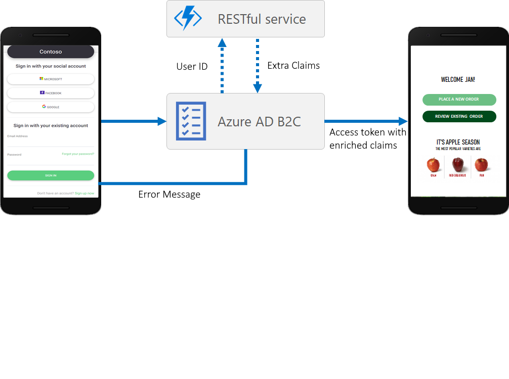

# Coach's Guide - Day 2 - Challenge 06 - Claims Enrichment with API Connectors

 [< Previous Solution](./Solution_D2_05.md) - **[Home](./README.md)** - [Next Solution >](./Solution_D2_07.md)

## Introduction

Azure Active Directory B2C (Azure AD B2C) enables identity developers to integrate an interaction with a RESTful API into their user flow using API connectors. It enables developers to dynamically retrieve data from external identity sources. 

For example, with API connectors, you can:

- **Validate user input data**. Validate against malformed or invalid user data. For example, you can validate user-provided data against existing data in an external data store or list of permitted values. If invalid, you can ask a user to provide valid data or block the user from continuing the sign-up flow.
- **Verify user identity**. Use an identity verification service or external identity data sources to add an extra level of security to account creation decisions.
- **Integrate with a custom approval workflow**. Connect to a custom approval system for managing and limiting account creation.
- **Augment tokens with attributes from external sources**. Enrich tokens with attributes about the user from sources external to Azure AD B2C such as cloud systems, custom user stores, custom permission systems, legacy identity services, and more.
- **Overwrite user attributes**. Reformat or assign a value to an attribute collected from the user. For example, if a user enters the first name in all lowercase or all uppercase letters, you can format the name with only the first letter capitalized.
- **Run custom business logic**. You can trigger downstream events in your cloud systems to send push notifications, update corporate databases, manage permissions, audit databases, and perform other custom actions.

[About API connectors in Azure AD B2C](https://learn.microsoft.com/en-us/azure/active-directory-b2c/api-connectors-overview?pivots=b2c-user-flow)

### Enrich tokens

You can use API connectors applied to the Before sending the token step to enrich tokens for your applications with information from external sources. When a user signs in or signs up, Azure AD B2C will call the API endpoint configured in the API connector, which can query information about a user in downstream services such as cloud services, custom user stores, custom permission systems, legacy identity systems, and more.

[Token enrichment - Azure Active Directory B2C](https://learn.microsoft.com/en-us/azure/active-directory-b2c/add-api-connector-token-enrichment?pivots=b2c-user-flow)

### Challenge Walkthrough

In this challenge students will deploy an Azure function which will act as an external identity source for Claims enrichment.



The .NET function app project is located in this GitHub repository (Student->Resources->Challenge_D2_06).

Attendees should clone the repository and run the provided Azure CLI commands to deploy the function App in Azure.

Attendees must use the script provided to deploy the application.
You can find the script [here](../Student/Resources/Challenge_D2_06/DeployClaimsEnrichAPIB2C.azcli)

Ensure that attendees configured the following parameters in the script.

```powershell
# Deployment Parameters
$subscription = "[Enter your Subscription Id]"
$ApiUserName = "[Enter The Api Connector Username]"
$ApiPassword = "[Enter The Api Connector Password]"
$extensions-app-id = "[Enter The Extension App Id. This is the client id of the app registration created during Azure AD B2C tenant creation]"
# Define the Visual Studio project directory
$projectPath = "<Your repository path>\Student\Resources\Challenge_2_06\AzureAD.Identity.B2C.API.ClaimsEnrichment\AzureAD.Identity.B2C.API.ClaimsEnrichment.csproj"
```

You can protect your API endpoint by using either HTTP basic authentication or HTTPS client certificate authentication.

In this example HTTP basic authentication is used for simplicity.

Please note that the Azure function is build on .Net 6.0

The script uses the Azure CLI and executes the following steps:

- Login to Azure
- Set subscription to use in current context
- Create Resource group if not exists
- Create storage account for the function app
- Create the Function App
- Configure the application setting on the Function app
  - WWEBSITE_RUN_FROM_PACKAGE="1"  
  - ASPNETCORE_ENVIRONMENT="Development"
  - ApiUserName=$ApiUserName
  - ApiPassword=$ApiPassword
  - extensions-app-id=$extensions-app-id
- Build .Net app
- Publish the application to a local folder
- Compress the publish folder to a zip file
- Deploy the application to the Azure function app (uses the published zip file)

#### References for this challenge

  [Enrich tokens with claims from external sources using API connectors](https://learn.microsoft.com/en-us/azure/active-directory-b2c/add-api-connector-token-enrichment?pivots=b2c-user-flow)
  
  [Zip push deployment for Azure Functions](https://learn.microsoft.com/en-us/azure/azure-functions/deployment-zip-push#cli)
  
  [Secure APIs used as API connectors in Azure AD B2C - Azure AD B2C](https://learn.microsoft.com/en-us/azure/active-directory-b2c/secure-rest-api?tabs=windows&pivots=b2c-user-flow)
  