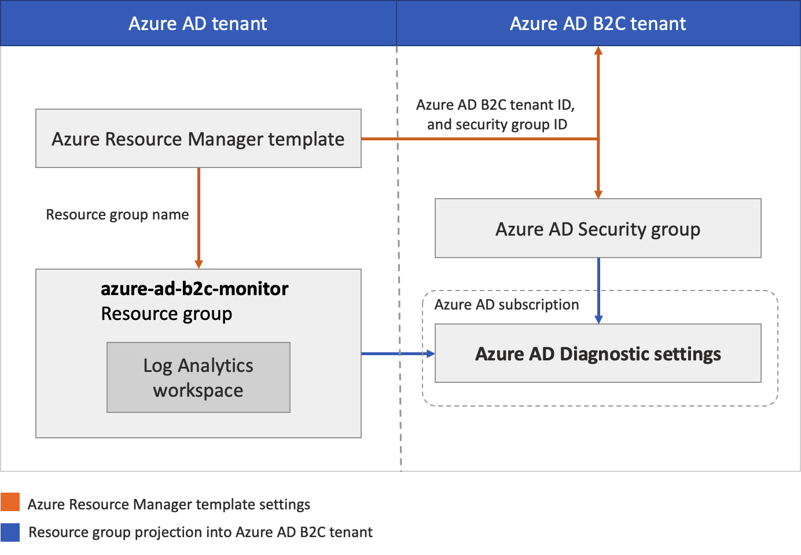

# Coach's Guide - Day 2 - Challenge 07 - Monitoring and Observability

 [< Previous Solution](./Solution_D2_06.md) - **[Home](./README.md)** - [Next Advanced Solution (Optional)>](./Solution_D2_08.md)

 ## Introduction

In this challenge attendees should monitor the B2C activity by proceeding with the following:
- use a Log Analytics workspace to collect data from Azure AD B2C logs
- visualize it with queries and workbooks
- create alerts in Azure Monitor

Azure Monitor logs is a solution that consolidates monitoring data from different sources and provides a query language and analytics engine that gives you insights into the operation of your applications and resources. By sending Azure AD activity logs to Azure Monitor logs, you can quickly retrieve, monitor and alert on collected data.

By sending resource logs to a Log Analytics workspace the attendees will enable the features of Azure Monitor Logs, where you can:

- Correlate resource log data with other monitoring data collected by Azure Monitor.
- Consolidate log entries from multiple Azure resources, subscriptions, and tenants into one location for analysis together.
- Use log queries to perform complex analysis and gain deep insights on log data.
- Use log alerts with complex alerting logic.
- Create a diagnostic setting to send resource logs to a Log Analytics workspace. This data is stored in tables as described in Structure of Azure Monitor Logs. The tables used by resource logs depend on what type of collection the resource is using:

- Azure diagnostics: All data is written to the AzureDiagnostics table.
- Resource-specific: Data is written to individual tables for each category of the resource.

They can follow the procedure in the Microsoft Learn guide document provided. The guide includes the following steps:

### 1. Integration between Azure AD B2C and Log Analytics, which is where we'll send the logs

Attendes should:
- Create or choose resource group
- Create a Log Analytics workspace
- Deploy an Azure Resource Manager template to the subscription that contains the Log Analytics workspace

The following diagram shows the components you'll configure in your Azure AD and Azure AD B2C tenants.

- Configure diagnostic settings, that define where logs and metrics for a resource should be sent

### 2. Configure the Log Analytics workspace to query and visualize the data

Attendees must firstly create a  Kusto Query Language query in Log Analytics workspace that shows policy usage by operation over the past x days - default 90 days (90d).
By using the render operator in the query, the attendees can visualize the data as a piechar diagram.

### 3. Create alert rules in Azure Monitor 

When certain events occur or are absent, attendees must showcase how to create alert rules in Azure Monitor based on some specific events. If there is a drop of 25% or more in the total requests within the past hour, create a query and a new alert rule.

 #### References for this challenge

 
[Monitor Azure AD B2C with Azure Monitor - Azure AD B2C](https://docs.microsoft.com/en-us/azure/active-directory-b2c/azure-monitor) 

[Azure Active Directory activity logs in Azure Monitor](https://docs.microsoft.com/en-us/azure/active-directory/reports-monitoring/concept-activity-logs-azure-monitor)

[Sign-in logs in Azure Active Directory](https://docs.microsoft.com/en-us/azure/active-directory/reports-monitoring/concept-sign-ins)

[Access and review audit logs - Azure AD B2C](https://docs.microsoft.com/en-us/azure/active-directory-b2c/view-audit-logs)