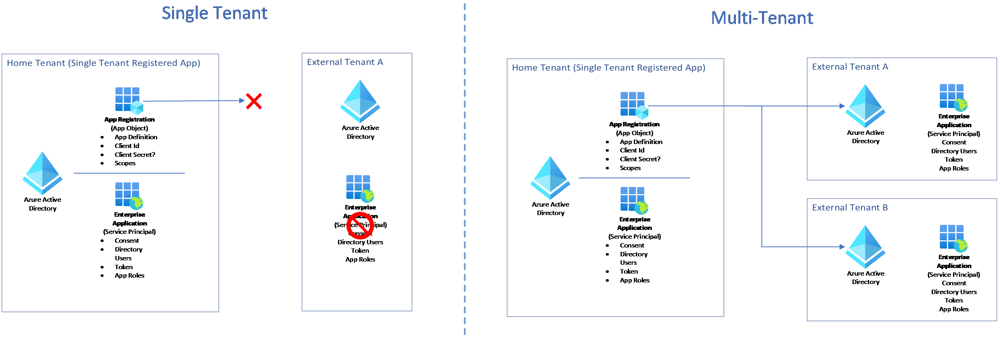

# Day 1 - Challenge 07 - Make your application Multitenant

 [< Previous Challenge](./Challenge_D1_06.md) - **[Home](../README.md)** - [Next Advanced Challenge (Optional) >](./Challenge_D1_08.md)

## Introduction

You have a request from the Product Owner to enable multi-tenancy in your App Registration in order to avoid adding your partner accounts as External Identities in your Tenant.

## Description

In the previous challenge you successfully configured the conditional access policy and multifactor authentication.

While demonstrating the PoC to the Product Team, you acknowledged that you need to include all of your partner's account identities in your tenant.

You meet the business requirements to allow your partners to log into the system, but you want to avoid inviting and managing access of your partners' identities.

Hence, you and the Product Owner decided to configure the application to accept sign-ins from your partner’s Azure Active Directory (Azure AD) “ExternalTenant”.
This configuration is called making your application multi-tenant. Users in your partner’s Azure AD tenant will be able to sign in to your application after consenting to use your application.

The following diagram shows the Single Tenant compared to Multitenant apps in terms of Application Registration (App Object) and Enterprise Application (Service Principal).

The application object (App Registration) is the *global* representation of your application for use across all tenants, and the service principal (Enterpise Application) is the *local* representation for use in a specific tenant. The application object (App Registration) serves as the template from which common and default properties are *derived* for use in creating corresponding service principal objects (Enterpise Applications).

An application object (App Registration) has:

- A one-to-one relationship with the software application, and
- A one-to-many relationship with its corresponding service principal object(s) (Enterpise Application)

A service principal (Enterpise Application) must be created in each tenant where the application is used, enabling it to establish an identity for sign-in and/or access to resources being secured by the tenant. A single-tenant application has only one service principal (in its home tenant), created and consented for use during application registration. A multi-tenant application also has a service principal (Enterpise Application) created in each tenant where a user from that tenant has consented to its use.
## Success Criteria

- Verify that you deleted the invited external users ExternalUserA and ExternalUserB from your home tenant.
- Demonstrate that you can login with HomeUserA (which exist in your home tenant) account in your web application.
- Demonstrate that you can login with ExternalUserA (which exist in external tenant) account in your web application.
- Verify that the application configuration settings of the web application is properly set with the correct values required for enabling multitenancy.
- Verify that the Enterprise Application now exists in the “ExternalTenant”.
- Briefly explain the differences between Single Tenant and Multitenant Apps.
- Explain the differences between an App Registration (Application object) and Enterprise Application (Service Principal)
- Explain the usage of common endpoint

## Tips

You don’t need to make code changes and redeploy the application.

## Learning Resources

[Single and multi-tenant apps in Azure AD](https://docs.microsoft.com/en-us/azure/active-directory/develop/single-and-multi-tenant-apps)

[Application registration and Service principals](https://docs.microsoft.com/en-us/azure/active-directory/develop/app-objects-and-service-principals)

[Making your application multi-tenant](https://docs.microsoft.com/en-us/azure/active-directory/develop/howto-convert-app-to-be-multi-tenant)

[Configure app settings](https://learn.microsoft.com/en-us/azure/app-service/configure-common?tabs=portal#configure-app-settings)
