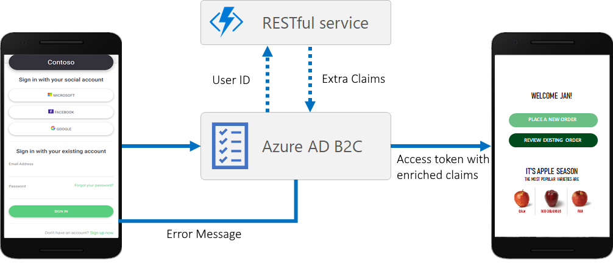

# Day 2 - Challenge 06 - Claims Enrichment with API Connectors

 [< Previous Challenge](./Challenge_D2_05.md) - **[Home](../README.md)** - [Next Challenge >](./Challenge_D2_07.md)

## Introduction

During your research you discover that Azure AD B2C provides the ability to integrate RESTful APIs into your User Flows (or with custom policies) using a feature called API Connector.

You have made the recommendation to the Product Team that this can be used as a solution for claims enrichment and input validation during authentication. The Product Owner agreed with your recommendation and asked you to proceed.



## Description

Azure Active Directory B2C (Azure AD B2C) enables identity developers to integrate an interaction with a RESTful API into their user flow using API connectors. It enables you to dynamically retrieve data from external identity sources and enrich token claims with information from external sources.

You can use API connectors applied to the “Before sending the token” step to enrich tokens for your applications with information from external sources. When a user signs in or signs up, Azure AD B2C will call the API endpoint configured in the API connector, which can query information about a user in services such as cloud services, custom user stores, custom permission systems, legacy identity systems, and more.

After retrieving the token with the extra claims you can make your authorization decisions in the application code.

One of your developers implement this API service as a .Net solution and your DevOps engineer prepared the following Azure CLI script which you can run on a PowerShell env to deploy the solution in Azure as a Function App. 

Now it is time to deploy the custom API as an Azure function and demonstrate the solution to the Product team.

After deploying the function app you should configure within your sign in flow, the API connector “Before sending the token”.

NOTE: The .NET function app project is located in this GitHub repository (Student->Resources->Challenge_D2_06). You can clone the repository and run the following Azure CLI commands (you should also configure some parameters) to deploy the function App in Azure.

```powershell
# Deployment Parameters 
$subscription = "[Enter your Subscription Id]"
$ApiUserName = "[Enter The Api Connector Username]"
$ApiPassword = "[Enter The Api Connector Password]"
$extensions-app-id = "[Enter The Extension App Id. This is the client id of the app registration created during Azure AD B2C tenant creation]"
# Define the Visual Studio project directory
$projectPath = "<Your repository path>\Student\Resources\Challenge_2_06\AzureAD.Identity.B2C.API.ClaimsEnrichment\AzureAD.Identity.B2C.API.ClaimsEnrichment.csproj"

# Other Parameters 
$location = "eastus"
$resourceGroupName = "IdentityHackathon"
$random = Get-Random
$functionName = "identityhackathon-b2c-api-" + $random
$storageName = "funstorage" + $random
$PublishFolder = "publish-b2c-api-" + $random

# Login to Azure 
az login

# Set default account subscription
az account set --subscription $subscription

# Useful commands for login in Azure
# az account show
# az account list
# az logout

# Create resource group
az group create --location $location --resource-group $resourceGroupName

# Create an Azure storage account in the resource group.
az storage account create --name $storageName --location "$location" --resource-group $resourceGroupName --sku "Standard_LRS"

# Create a serverless function app in the resource group.
az functionapp create --name $functionName --storage-account $storageName --consumption-plan-location "$location" --resource-group $resourceGroupName --functions-version "4"

# Set Web App Configuration App Settings
az functionapp config appsettings set --resource-group $resourceGroupName --name $functionName --settings WEBSITE_RUN_FROM_PACKAGE="1"  ASPNETCORE_ENVIRONMENT="Development" ApiUserName=$ApiUserName ApiPassword=$ApiPassword extensions-app-id=$extensions-app-id

# Build and publish the project in local directory
dotnet build $projectPath --configuration Release 
dotnet publish $projectPath --configuration Release -o .\$PublishFolder

# Compress and add in zip file the published version
Compress-Archive -Path .\$PublishFolder\* -DestinationPath ./$PublishFolder.zip -Force
# Deploy the Zip file to Azure Function.
az functionapp deployment source config-zip --resource-group $resourceGroupName --name $functionName --src "./$PublishFolder.zip"

$functionUrl = az functionapp function show --resource-group $resourceGroupName --name $functionName --function-name ClaimsEnrichment --query href
echo "Use the below function URL and username/password in your API Connector"
echo "Function URL: $functionUrl"
echo "Username: $ApiUserName"
echo "Password: $ApiPassword"
```

You can find the script [here](./Resources/Challenge_D2_06/DeployClaimsEnrichAPIB2C.azcli)

## Tips

The output claims in the API connector are formatted as “extension_<ext_app_id>_<Custom Claim>”. The <ext_app_id> in the middle is the App ID of the B2C Extensions app in your B2C tenant.

That app registration was created when your B2C tenant was created. You need to update the function app configuration settings with this app id.

## Success Criteria

- Demonstrate that you have successfully deployed the Azure Function on Azure.
- Verify that the application configuration settings of the Azure Function you recently deployed in Azure are properly set (ApiUserName, ApiPassword and extensions-app-id)
- Demonstrate that you can login with a user and verify that the custom claims are included in the Application Claims section (in application top navigation).
  
## Learning Resources
  
  [Enrich tokens with claims from external sources using API connectors](https://learn.microsoft.com/en-us/azure/active-directory-b2c/add-api-connector-token-enrichment?pivots=b2c-user-flow)
  
  [Zip push deployment for Azure Functions](https://learn.microsoft.com/en-us/azure/azure-functions/deployment-zip-push#cli)
  
  [Secure APIs used as API connectors in Azure AD B2C - Azure AD B2C](https://learn.microsoft.com/en-us/azure/active-directory-b2c/secure-rest-api?tabs=windows&pivots=b2c-user-flow)
  
  [About API connectors in Azure AD B2C](https://learn.microsoft.com/en-us/azure/active-directory-b2c/api-connectors-overview?pivots=b2c-user-flow)
  
  [Enrich tokens with claims from external sources using API connectors](https://learn.microsoft.com/en-us/azure/active-directory-b2c/add-api-connector?pivots=b2c-user-flow)
